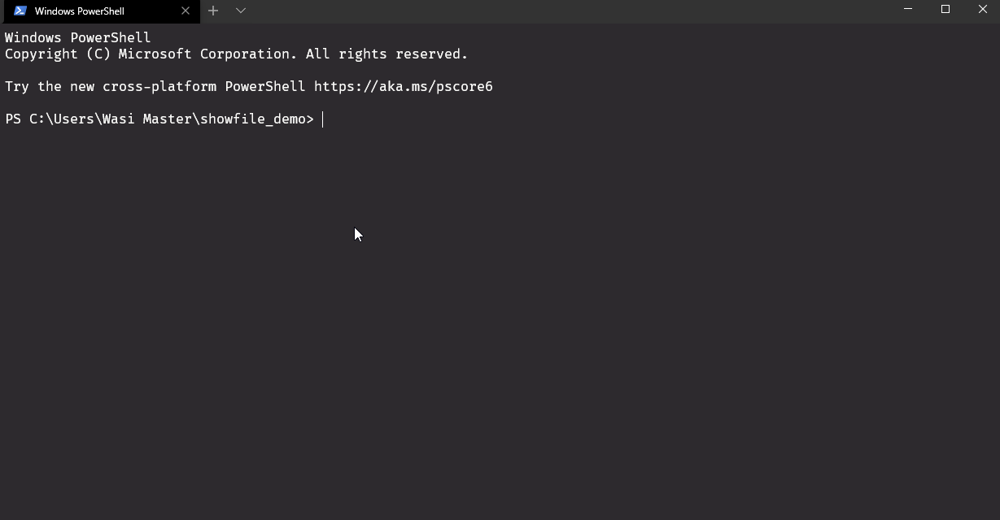
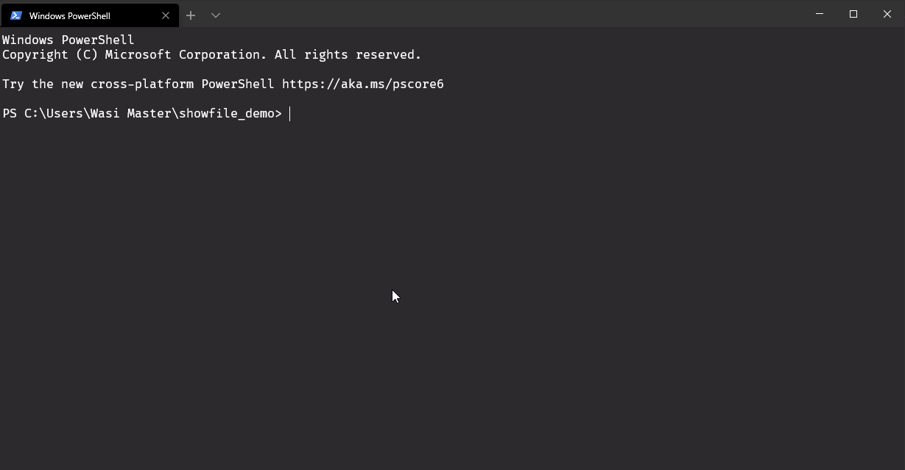
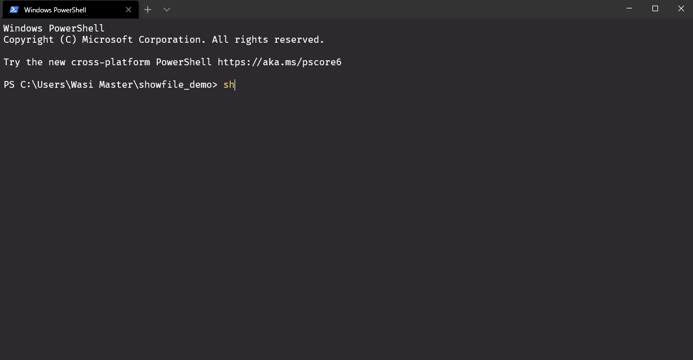
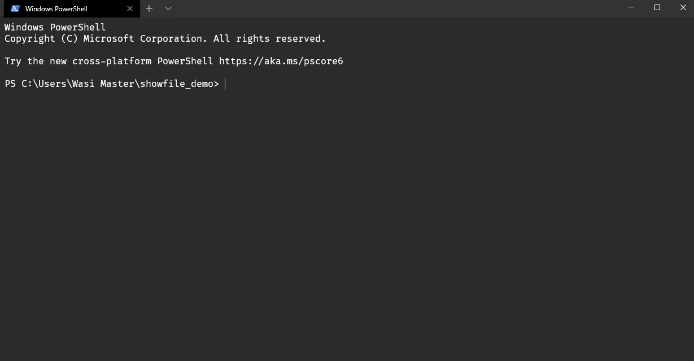
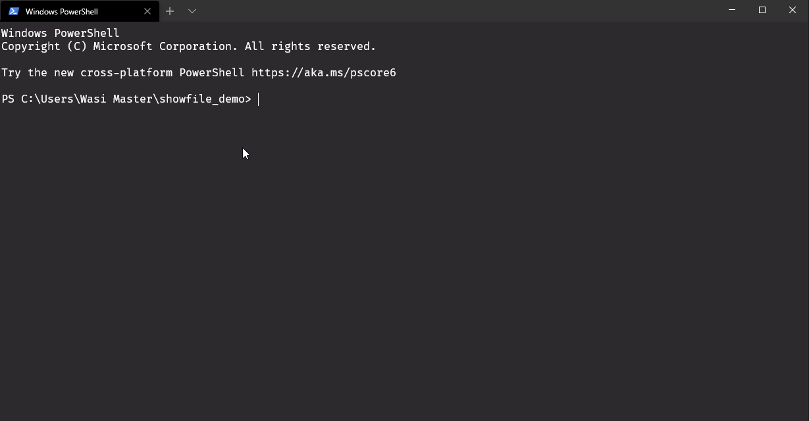
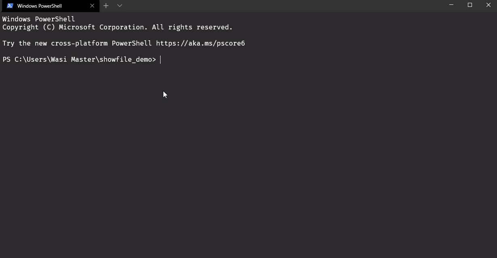
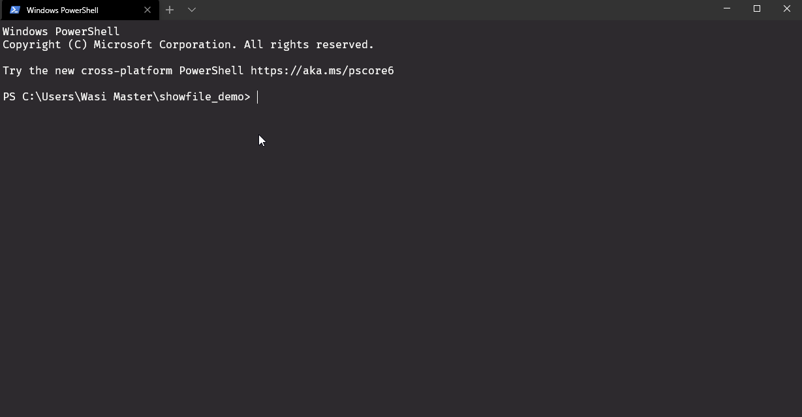
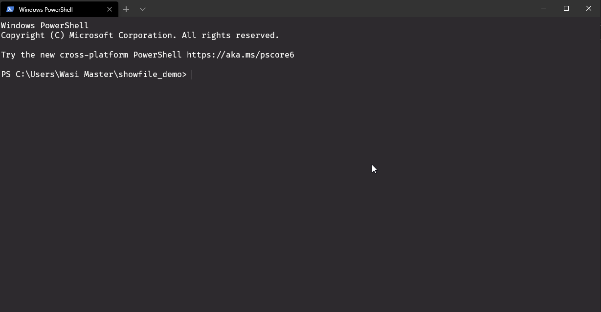
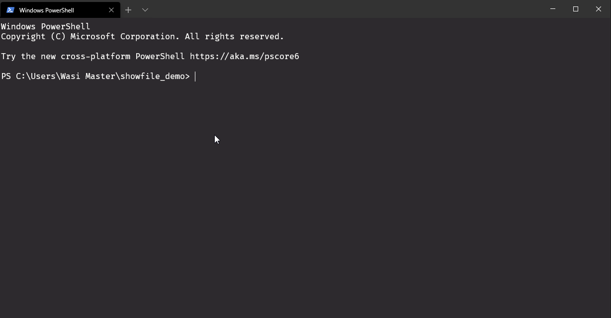

# Demo

## bash

## Clojure

## CoffeeScript

## C++

## C Sharp

## CSS

## Elm

## Go

## HTML

## INI

## Java

## JavaScript

## JSON

## Objective C

## Python

## Ruby

## Rust

## SQL

## Swift

## TypeScript

